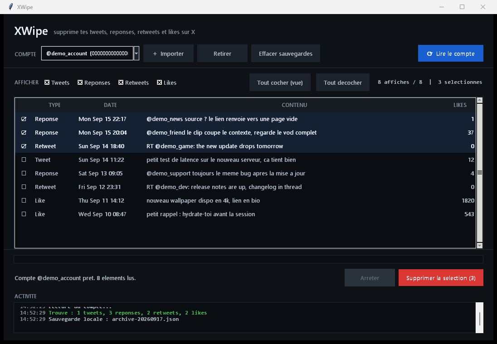

# XWipe

Delete your own tweets, replies, retweets and likes on X (Twitter), from a
desktop app. You import an account by pasting its session cookies, read the
account, pick what to remove, and confirm. The machine talks to x.com directly:
no server, no API key, nothing sent anywhere else.

## What it does

- Reads the full account back to its creation date: tweets, replies, retweets,
  and likes, merged and de-duplicated across X's timelines.
- Removes exactly what you select. Tweets and replies are deleted, retweets are
  undone on the source tweet, likes are removed with UnfavoriteTweet.
- Verifies every removal by re-querying the tweet id, since an HTTP 200 does not
  prove deletion (X is eventually consistent and the timelines lag).
- Keeps a local archive before any deletion, so you have a copy of what you
  removed. X allows no undo on its side.

## Why it is built this way

- **Identity by rest_id, never the handle.** A renamed account keeps its rest_id,
  which is the only stable identifier. XWipe only ever touches content owned by
  the session it holds.
- **queryId extracted at runtime.** X rotates its GraphQL query ids; XWipe reads
  them from the current web bundle instead of hardcoding them.
- **Cookies encrypted at rest.** On Windows they are sealed with DPAPI, bound to
  your Windows user. A stolen file on another machine is useless.

## Run it

Download `XWipe.exe` and double-click. It is a single standalone file, no
install, no dependency.

To run from source (Python 3, standard library only, needs tkinter):

    python -m xwipe

## Import an account

The simplest path uses the EditThisCookie browser extension:

1. Open x.com while logged into the account.
2. Click the EditThisCookie icon, then Export.
3. Paste the whole export into XWipe. It finds `auth_token` and `ct0` on its own.

A raw `Cookie:` header copied from the browser dev tools works too, as does
pasting the two values `auth_token` and `ct0` one under the other.

## Use it

1. Pick the account, click Read the account.
2. Filter by type (tweets, replies, retweets, likes) and check what you want to
   remove. Space or Enter toggles a row; the toolbar checks or clears the view.
3. Click Delete the selection and confirm. Removal runs, then a verification
   pass re-checks each item and retries anything still present.
4. Erase local backups when you are done, to remove the on-disk copy of what was
   read.

## Limits

- X caps the profile history it serves at roughly 3200 posts per timeline. Past
  that server-side ceiling, no client can reach further back.
- Windows desktop only. The interface is French.
- Not affiliated with X. You act on an account whose session you hold, and
  deletion on X is permanent.

## Build

    python -m PyInstaller xwipe.spec --noconfirm --clean

The result is `dist/XWipe.exe`.

## Tests

- `python tests.py` runs the offline suite (28 checks, each with a negative
  control). No network.
- `ACCOUNT_ENV=<path to .env> python it_readonly.py` runs a live, read-only
  integration test against a real account. The destructive methods are trapped,
  so it cannot remove anything.

## License

XWipe is proprietary, commercial software. It is not open source and not free to
use. A valid paid license is required. See [LICENSE](LICENSE) for the terms, and
contact the copyright holder for licensing.
